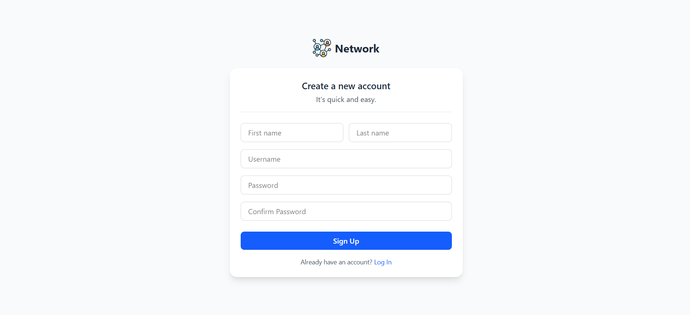
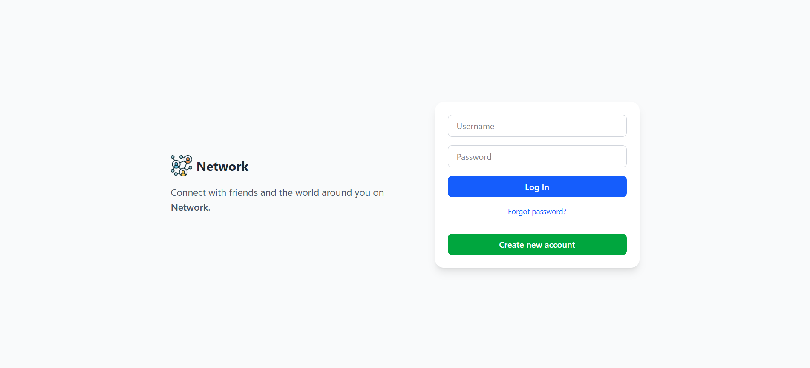
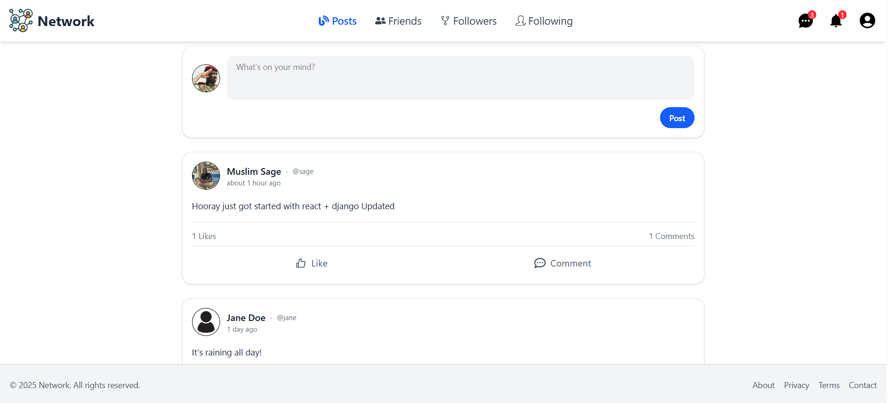
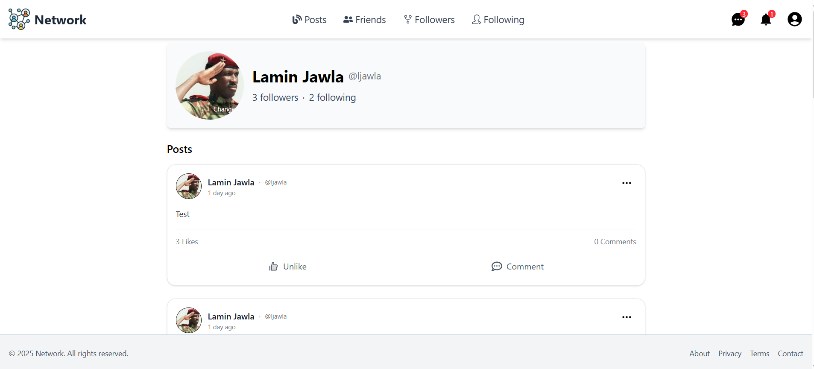

# 🌐 Network

**Network** is a social media platform inspired by Threads, where users can share posts, follow others, and engage in a connected community.

---

## ⚙️ Tech Stack

### 🔹 Backend

- Python
- Django
- Django REST Framework

### 🔹 Frontend

- TypeScript
- React

### 🔹 Database

- PostgreSQL

### 🔹 DevOps & Tools

- Git & GitHub
- Docker & Docker Compose

---

## 🚀 Getting Started

### 1️⃣ Clone the Repository

```bash
git clone https://github.com/laminjawla1/Network
cd Network
```

---

### 2️⃣ Run the Backend

```bash
cd backend
docker compose up --build
```

Backend will be available at:
👉 [http://localhost:8000/](http://localhost:8000/)

---

### 3️⃣ Run the Frontend

```bash
cd ../frontend
docker compose up --build
```

Frontend will be available at:
👉 [http://localhost:5173/](http://localhost:5173/)

---

## 🌟 Features (Current & Planned)

- 🔐 User authentication (register, login, password change)
- 👥 Follow and unfollow users
- 📝 Create, update, and delete posts
- 💬 Comment on posts
- ❤️ Like/unlike functionality
- 🔔 Notifications system (follows, likes, comments, etc.)
- 📸 Profile image upload and update

---

## 🎥 Demo & Screenshots

### 🔹 Register Page



### 🔹 Login Page



### 🔹 Feed Page



### 🔹 Notifications


### 🔹 User Profile



---

## 📌 Contribution

1. Fork the repo
2. Create a new branch (`feature/your-feature-name`)
3. Commit your changes
4. Push to your branch
5. Open a Pull Request 🚀

---

## 📄 License

This project is licensed under the **MIT License**.
